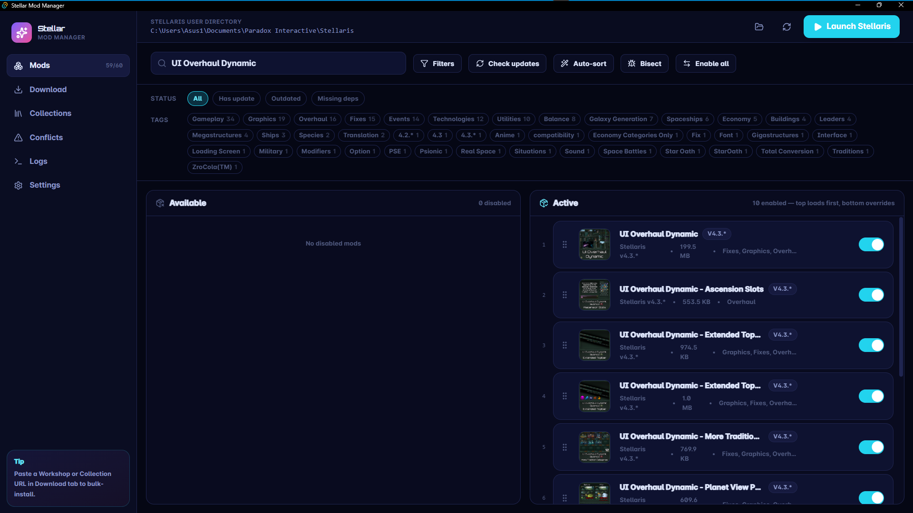

# Stellar Mod Manager

A fast, modern mod manager for Stellaris — works with **both Steam and cracked/offline builds**. Downloads Workshop mods via SteamCMD anonymous login (with public-mirror fallback), manages load order, detects conflicts, and ships with a gorgeous dark UI.

*(English below — [Tiếng Việt](#tiếng-việt) bên dưới)*

    [](https://github.com/khoyga007/Stellaris-Mod-Manager/releases/latest)



---

## Download

Grab the latest Windows installer from the [**Releases page**](https://github.com/khoyga007/Stellaris-Mod-Manager/releases/latest):

- `Stellar Mod Manager_<version>_x64-setup.exe` — NSIS installer (recommended, smaller)
- `Stellar Mod Manager_<version>_x64_en-US.msi` — MSI installer (for group policy / silent install)

Current release: **[v0.1.1](https://github.com/khoyga007/Stellaris-Mod-Manager/releases/tag/v0.1.1)**

---

## Features

### Downloads
- **SteamCMD anonymous** — first-try provider. No Steam account needed, no purchase required.
- **Batch mode** — N mods in a single SteamCMD session = ~2.3× faster than one-by-one (1 login handshake instead of N).
- **Web-mirror fallback** — if SteamCMD fails, automatically tries `steamworkshop.download`, `steamworkshopdownloader.io`, and `smods.ru`.
- **Collection support** — paste a Collection URL, app fetches the list and queues everything.
- **Clipboard sniff** — detects Workshop URLs copied to clipboard and offers to add them.
- **Activity cards** — real-time progress with mod title + thumbnail resolved via Steam Workshop API.
- **Retry failed / Clear done** — per-item retry button and bulk cleanup.
- **Manual fallback** — built-in link to `steamworkshopdownloader.io` + zip import if all else fails.

### Mod management
- **Drag-and-drop load order** — two-pane UI (Available / Active), drag cards to reorder or enable/disable.
- **Auto-sort** — hybrid DAG + bucket topological sort using each mod's declared dependencies, with preview dialog before applying.
- **Conflict detector** — scans enabled mods for overlapping game files (e.g. two mods overwriting `common/technology/00_strat_resources.txt`) and reports which load-order wins.
- **Bisect mode** — 50/50 binary search to find the mod causing a crash. Disables half, prompts you to launch, mark good/bad, repeat.
- **Update check** — per-mod and "Update all" using Steam's `time_updated` vs local mtime.
- **Version compatibility** — reads `launcher-settings.json` next to `stellaris.exe` to detect game version; shows "outdated" badge when `supported_version` mismatches.
- **Missing-dependency warning** — blocks launch with a dialog listing missing or disabled deps.

### Safety & polish
- **`dlc_load.json` backups** — automatic snapshots (content-hash dedupe, keeps last 5) with one-click restore + undo-the-undo.
- **Presets / Playsets** — save multiple enabled+order loadouts, switch in one click.
- **Themes** — Midnight, Imperial, Black Gold, Dark Star (each with curated Google Fonts).
- **i18n** — English + Vietnamese, auto-detected from browser locale, toggle in Settings.
- **Filters** — search + multi-select tag filter (AND logic) + status filter (updates / outdated / missing-deps).

---

## Install & run (development)

```bash
# Prerequisites: Node 18+, pnpm/npm, Rust stable, Windows
git clone https://github.com/khoyga007/Stellaris-Mod-Manager.git
cd Stellaris-Mod-Manager
npm install
npm run tauri dev
```

Production build:

```bash
npm run tauri build
# Installer → src-tauri/target/release/bundle/
```

---

## Networking notes

SteamCMD talks to Steam's CM servers. Some ISPs block these connections — if SteamCMD fails with `No connection`, enable **Cloudflare WARP** (free) and retry. The app will auto-fall-back to web mirrors when SteamCMD is unavailable, but SteamCMD is significantly faster and more reliable.

---

## Architecture

| Layer       | Stack                                                              |
|-------------|--------------------------------------------------------------------|
| Frontend    | React 18, TypeScript, Tailwind v4, Framer Motion, Lucide icons     |
| Shell       | Tauri 2                                                            |
| Backend     | Rust (`reqwest`, `tokio`, `zip`, `anyhow`)                         |
| Downloads   | SteamCMD subprocess + `reqwest` mirror clients                     |
| Persistence | JSON files in `AppData/Roaming/StellarMM` + Stellaris `dlc_load.json` |

Key modules in `src-tauri/src/`:

- `steamcmd.rs` — SteamCMD lifecycle, single and batch download
- `workshop.rs` — meta fetching, mirror providers, zip extraction
- `auto_sort.rs` — Kahn's algorithm + bucket sort for load order
- `conflicts.rs` — file-overlap analysis
- `backups.rs` — `dlc_load.json` snapshot ring buffer

---

## Status

Active development. See commit history for recent changes.

---

<a name="tiếng-việt"></a>
# Stellar Mod Manager *(Tiếng Việt)*

Trình quản lý mod Stellaris nhanh, hiện đại — **chạy được cho cả bản Steam lẫn bản crack/offline**. Tải mod Workshop qua SteamCMD anonymous (có fallback sang các mirror công khai), quản lý load order, phát hiện xung đột, giao diện dark đẹp.

## Tải về

Tải installer Windows mới nhất ở [**trang Releases**](https://github.com/khoyga007/Stellaris-Mod-Manager/releases/latest):

- `Stellar Mod Manager_<version>_x64-setup.exe` — NSIS installer (khuyên dùng, nhẹ hơn)
- `Stellar Mod Manager_<version>_x64_en-US.msi` — MSI installer (cho group policy / silent install)

Bản hiện tại: **[v0.1.1](https://github.com/khoyga007/Stellaris-Mod-Manager/releases/tag/v0.1.1)**

## Tính năng

### Tải về
- **SteamCMD anonymous** — provider chính, không cần tài khoản Steam hay mua game.
- **Chế độ batch** — tải N mod trong 1 phiên SteamCMD duy nhất = **nhanh hơn ~2.3×** so với tải từng mod (chỉ 1 lần login handshake thay vì N lần).
- **Fallback qua web mirror** — nếu SteamCMD fail, tự động thử `steamworkshop.download`, `steamworkshopdownloader.io`, và `smods.ru`.
- **Hỗ trợ Collection** — dán URL Collection, app sẽ fetch danh sách và xếp hàng cài hết.
- **Nhận diện clipboard** — phát hiện URL Workshop đã copy và đề xuất thêm vào.
- **Thẻ hoạt động** — hiển thị progress realtime kèm **tên mod thật + thumbnail** (resolve qua Steam Workshop API).
- **Thử lại / Xoá xong** — nút retry từng mod lỗi + dọn sạch bulk.
- **Fallback thủ công** — link sẵn `steamworkshopdownloader.io` + import zip khi mọi cách đều fail.

### Quản lý mod
- **Kéo-thả load order** — UI 2 cột (Khả dụng / Đang bật), kéo thẻ để đổi thứ tự hoặc bật/tắt.
- **Sắp xếp tự động** — hybrid DAG + bucket topo sort dựa trên `dependencies` mỗi mod, có dialog preview trước khi áp dụng.
- **Phát hiện xung đột** — quét các mod đang bật tìm file game bị ghi đè trùng (vd 2 mod cùng sửa `common/technology/00_strat_resources.txt`), báo mod nào load sau sẽ thắng.
- **Chế độ Bisect** — binary search 50/50 để tìm mod gây crash. Tắt nửa số mod, nhắc bạn launch, đánh dấu good/bad, lặp lại.
- **Kiểm tra cập nhật** — từng mod hoặc "Update all" dựa trên `time_updated` Steam vs mtime cục bộ.
- **Kiểm tra tương thích phiên bản** — đọc `launcher-settings.json` cạnh `stellaris.exe` để lấy phiên bản game; hiện badge "lỗi thời" khi `supported_version` không khớp.
- **Cảnh báo thiếu phụ thuộc** — chặn launch với dialog liệt kê deps thiếu hoặc đang tắt.

### An toàn & chăm chút
- **Sao lưu `dlc_load.json`** — tự snapshot (dedupe theo content-hash, giữ 5 bản gần nhất), khôi phục 1 click + undo-the-undo.
- **Preset / Playset** — lưu nhiều bộ enabled+order, đổi trong 1 click.
- **Chủ đề** — Midnight, Imperial, Black Gold, Dark Star (mỗi theme có Google Fonts riêng).
- **Đa ngôn ngữ** — tiếng Anh + tiếng Việt, auto-detect theo locale trình duyệt, toggle trong Cài đặt.
- **Bộ lọc** — tìm kiếm + lọc theo tag (multi-select, AND) + lọc trạng thái (có cập nhật / lỗi thời / thiếu deps).

## Cài đặt & chạy (dev)

```bash
# Yêu cầu: Node 18+, pnpm/npm, Rust stable, Windows
git clone https://github.com/khoyga007/Stellaris-Mod-Manager.git
cd Stellaris-Mod-Manager
npm install
npm run tauri dev
```

Build production:

```bash
npm run tauri build
# Installer → src-tauri/target/release/bundle/
```

## Lưu ý mạng

SteamCMD kết nối đến Steam CM servers. Một số ISP tại Việt Nam chặn các kết nối này — nếu SteamCMD báo `No connection`, **bật Cloudflare WARP** (miễn phí) rồi thử lại. App sẽ tự fallback sang web mirror khi SteamCMD không dùng được, nhưng SteamCMD nhanh và ổn định hơn nhiều.

## Kiến trúc

| Tầng        | Công nghệ                                                           |
|-------------|---------------------------------------------------------------------|
| Frontend    | React 18, TypeScript, Tailwind v4, Framer Motion, Lucide icons      |
| Shell       | Tauri 2                                                             |
| Backend     | Rust (`reqwest`, `tokio`, `zip`, `anyhow`)                          |
| Tải về      | SteamCMD subprocess + client `reqwest` cho mirror                   |
| Lưu trữ     | JSON trong `AppData/Roaming/StellarMM` + `dlc_load.json` của Stellaris |

Module chính trong `src-tauri/src/`:

- `steamcmd.rs` — quản lý SteamCMD, tải đơn và batch
- `workshop.rs` — fetch meta, providers mirror, giải nén zip
- `auto_sort.rs` — Kahn + bucket sort cho load order
- `conflicts.rs` — phân tích file overlap
- `backups.rs` — ring buffer snapshot `dlc_load.json`

## Trạng thái

Đang phát triển tích cực. Xem commit history để theo dõi thay đổi mới.

---

## License

Personal project — no license specified yet.
